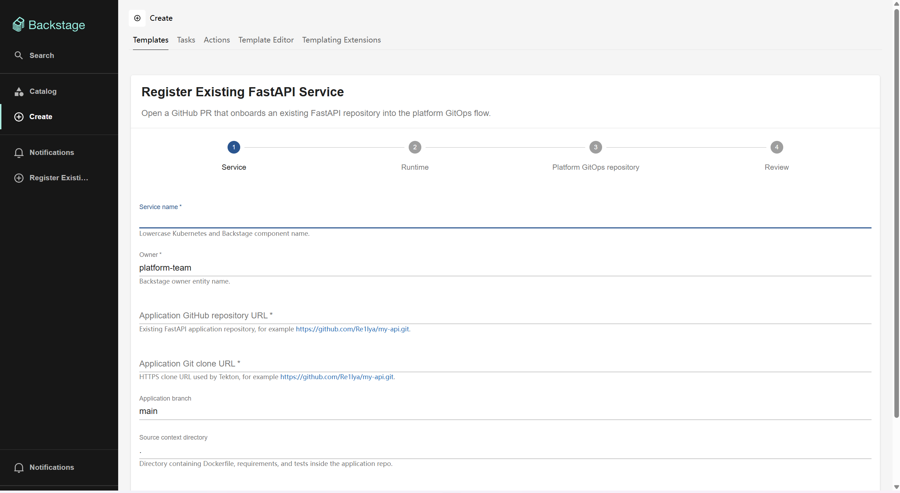
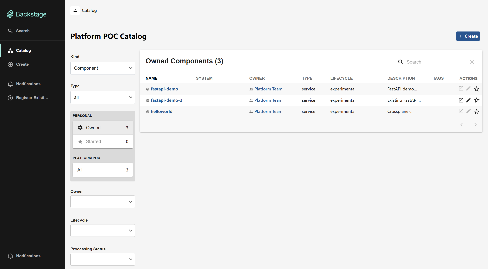
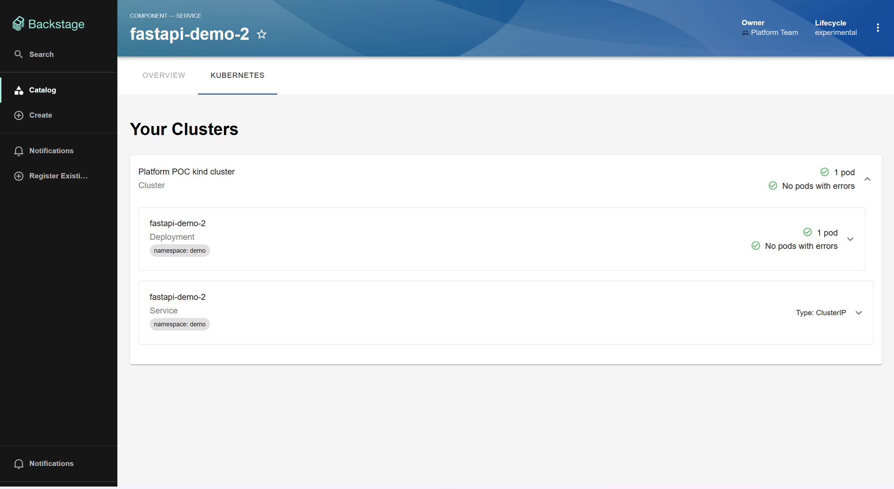
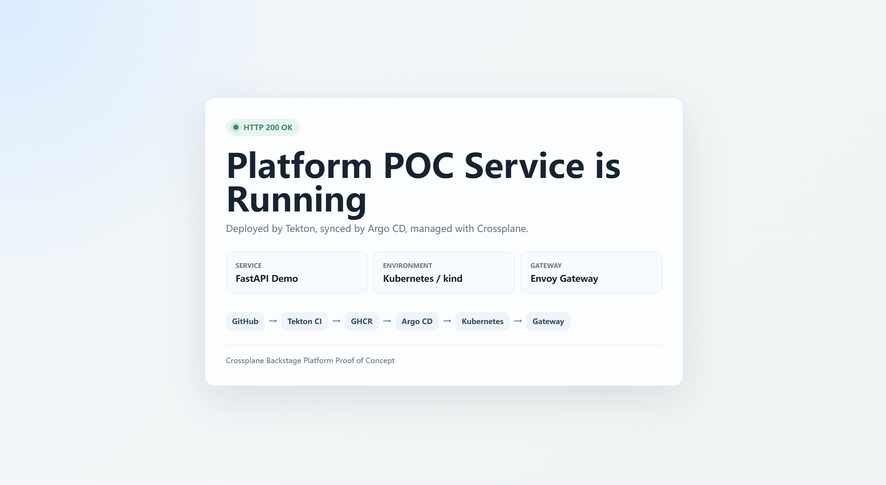

# 平台工程 POC — 报告与演示

## 1. 概述

本 POC 在本地 Kubernetes 集群（kind）上验证了一套**平台工程工作流**。开发者将代码推送到 GitHub，平台自动完成从构建到生产级交付的全部流程——全程可通过 Backstage、Argo CD 和 Tekton 仪表盘进行观测。

### 平台技术栈

| 层次 | 组件 | 职责 |
|-------|-----------|------|
| **CI** | Tekton Pipelines + Triggers | GitHub Webhook → 克隆 → 测试 → 构建 → 推送至 GHCR |
| **镜像仓库** | GitHub Container Registry (GHCR) | OCI 镜像存储 |
| **CD / GitOps** | Argo CD | 从 Git 同步 Helm Chart 到集群，自动修复 |
| **资源编排** | Crossplane (provider-helm) | 将 AppService 抽象组合成 Helm Release |
| **网关** | Envoy Gateway | 通过 HTTPRoute 暴露服务 |
| **开发者门户** | Backstage | 目录、Kubernetes 插件、自助式软件模板 |
| **运行时** | Kubernetes (kind) | 运行一切——平台控制面 + 应用工作负载 |

整个流程是**全 Git 驱动**的：代码推送触发 CI，CI 发布镜像，CI 更新 GitOps 仓库，Argo CD 同步新的目标状态，Crossplane 调和 Helm Release，Kubernetes 滚动更新 Pod——全程无需手动执行 `kubectl` 或 `docker` 命令。

---

## 2. 架构

```
┌──────────┐    Webhook     ┌───────────────┐
│  GitHub  │ ──────────────→│ Tekton         │
│  (Push)  │                │ EventListener  │
└──────────┘                └───────┬───────┘
                                    │ PipelineRun
                                    ▼
┌──────────────────────────────────────────────────────┐
│                 Tekton Pipeline                       │
│                                                       │
│  clone ──→ pytest ──→ BuildKit build ──→ push GHCR    │
│                                              │        │
│                                              ▼        │
│                              update GitOps values.yaml│
│                              commit & push [skip ci]  │
└──────────────────────────────────────────────────────┘
                                    │
                                    ▼
┌──────────┐    Sync (30s)   ┌───────────────┐
│  Argo CD │ ←────────────── │ GitHub (GitOps │
│          │                 │  chart path)   │
└────┬─────┘                 └───────────────┘
     │ AppService Helm chart
     ▼
┌────────────────┐
│  Crossplane    │
│  provider-helm │
└──────┬─────────┘
       │ Helm Release
       ▼
┌─────────────────────────────────────────┐
│          Kubernetes (kind)              │
│                                         │
│  Namespace: demo                        │
│  ├── Deployment  (fastapi-demo)         │
│  ├── Service     (fastapi-demo)         │
│  └── HTTPRoute   (fastapi-demo)         │
│                   │                     │
│                   ▼                     │
│           Envoy Gateway                 │
│           → http://<host>/              │
└─────────────────────────────────────────┘
       │
       │ backstage.io/kubernetes-id 标签
       ▼
┌────────────────┐
│   Backstage    │
│   目录 +       │
│   Kubernetes   │
│   插件         │
└────────────────┘
```

### 控制面 vs 应用面

| 层面 | 命名空间 | 运行内容 |
|-------|-----------|-----------|
| **控制面** | `crossplane-system`、`argocd`、`tekton-pipelines`、`ci`、`backstage`、`envoy-gateway-system` | 平台组件 |
| **应用面** | `demo`（按服务划分） | FastAPI 工作负载、Deployment、Service |

控制面组件**本身也由 Crossplane 管理**（Argo CD、Backstage），证明了平台可以实现自托管。

---

## 3. CI/CD 端到端流程

### 完整链路

```
GitHub 推送
  → GitHub Webhook
  → Tekton EventListener (ci/el-fastapi-demo-ci-listener)
  → PipelineRun 触发:
      1. clone           — 克隆仓库至对应 commit
      2. pytest          — 在 python:3.12-slim 中运行测试
      3. BuildKit build  — 无 root 的 OCI 构建，无需 Docker 守护进程
      4. push GHCR       — ghcr.io/re1lya/fastapi-demo:<commit-sha>
      5. update GitOps   — 编辑 charts/fastapi-demo-appservice/values.yaml
                           提交并推送，标记 [skip ci]
  → Argo CD 检测漂移，同步 chart（30 秒轮询）
  → Crossplane 将 AppService 声明调和成 Helm Release
  → provider-helm 部署运行时 chart（Deployment、Service）
  → Envoy Gateway 通过 HTTPRoute 路由外部流量
  → Backstage 在目录中展示服务，附带实时 Kubernetes 资源状态
```

### 已验证的 PipelineRun

Pipeline 已成功完成端到端运行：

```
PipelineRun: fastapi-demo-ci-krh4q
Image:        ghcr.io/re1lya/fastapi-demo:1ddefb7862e41ac2646e08c9bd8190248abfd373
Status:       Succeeded
```

每个步骤均可观测：
- **Tekton Dashboard** — Pipeline 日志、任务耗时、commit SHA
- **Argo CD UI** — 同步状态、差异对比、应用健康状态
- **Backstage** — 目录条目及 Kubernetes 资源面板

---

## 4. 开发者体验

### 通过 Backstage 实现自助式服务接入

当开发者需要部署一个新的 FastAPI 服务时，打开 Backstage 的 **Create** 页面，填写 **"Register Existing FastAPI Service"** 模板：



| 参数 | 示例 |
|-----------|---------|
| Service Name | `fastapi-demo` |
| Owner | `platform-team` |
| Source Repo URL | `https://github.com/Re1lya/Markdown.git` |
| Context Dir | `apps/fastapi-demo` |
| Image Repository | `ghcr.io/re1lya/fastapi-demo` |
| Runtime Namespace | `demo` |
| App Port | `8000` |
| Replicas | `1` |

### 后续流程 — 全自动化

模板会**自动创建一个 GitHub Pull Request**，包含接入服务所需的全部内容：

```
gitops/appservices/<serviceName>/        ← AppService Helm Chart（部署配置）
gitops/argocd/<serviceName>-appservice.yaml  ← Argo CD Application
gitops/tekton/<serviceName>-ci.yaml         ← Tekton EventListener + Pipeline
catalog/services/<serviceName>/catalog-info.yaml  ← Backstage 组件注册
```

### PR 合并之后

平台的 **app-of-apps** Argo CD 应用（一个管理 `argocd`，一个管理 `tekton`）会自动拾取新文件：

```
platform-appservices Argo CD 应用
  → 同步 gitops/argocd
  → 创建服务专属的 Argo CD Application
  → 同步 AppService Helm Chart
  → Crossplane 创建 AppService
  → provider-helm 将运行时资源部署到 demo 命名空间

platform-ci Argo CD 应用
  → 同步 gitops/tekton
  → 创建服务专属的 Tekton EventListener + Pipeline
  → 准备好接收新服务的 GitHub Webhook
```

### 开发者无需做的事

- ❌ 无需 `docker build` / `docker push`
- ❌ 无需 `kubectl apply`
- ❌ 无需 `helm install`
- ❌ 无需手写 CI 配置（Pipeline YAML 自动生成）
- ❌ 无需手写 GitOps 配置（Helm Chart + Application YAML 自动生成）
- ❌ 无需管理 GHCR 或 Git 的凭据

开发者只需：**在 Backstage 中填写表单 → 审核 PR → 合并**。其余全部自动化。

### Backstage 服务目录

服务接入并同步完成后，Backstage Catalog 会展示当前平台管理的组件。



### Backstage Kubernetes 运行状态

服务详情页中的 Kubernetes 面板会按 Catalog Entity 的 Kubernetes annotation 关联集群内资源，展示 Deployment、Service、Pod 数量和错误状态。



---

## 5. 对比 — 之前 vs 之后

| 步骤 | 传统方式 | 平台方式（本 POC） |
|------|-------------|---------------------|
| **脚手架 CI** | 手动编写 GitHub Actions / Jenkinsfile | Backstage 模板生成 Tekton Pipeline |
| **Docker 构建** | 本地 `docker build && docker push` | Tekton 在集群内运行无 root BuildKit，推送至 GHCR |
| **更新清单** | 手动编辑 YAML，`kubectl apply` | CI 提交至 GitOps 仓库；Argo CD 检测并同步 |
| **部署** | 手动 `helm upgrade` 或 `kubectl set image` | Argo CD 自动同步 → Crossplane 调和 Helm Release |
| **暴露服务** | 手动配置 Ingress/Service YAML | Envoy Gateway HTTPRoute，通过 Crossplane 自动生成 |
| **注册到目录** | 手动编写 `catalog-info.yaml` | 模板在 PR 中自动生成 |
| **可观测性** | `kubectl logs`、`kubectl get pods` | Argo CD UI（同步/健康状态）、Backstage Kubernetes 插件、Tekton Dashboard |

### 关键自动化节点

1. **构建** — 推送触发 Tekton；无 root BuildKit 构建并推送镜像，无需本地 Docker。
2. **GitOps 同步** — CI 将新镜像 tag 提交到 GitOps values 文件。Argo CD 在 30 秒内拾取变更。
3. **资源编排** — Crossplane 将高层 `AppService` 声明转化为具体 Helm Release，无需原始 Helm 命令。
4. **滚动更新** — Crossplane 更新 Deployment 镜像 tag 后，Kubernetes 执行标准滚动更新。

---

## 6. 服务访问验证

`fastapi-demo-2` 已通过 Envoy Gateway 暴露到本地端口：

```text
http://localhost:30080/
```

根路径返回服务部署成功页面，用于展示服务已经完成 CI/CD 并在 Kubernetes 中运行。



健康检查接口：

```text
http://localhost:30080/health
```

返回：

```json
{"status":"ok"}
```

## 7. 手动提交与观察测试反馈

如果需要手动制造一次提交来触发 CI/CD，可以修改 FastAPI 示例服务中的任意可提交内容，例如：

```powershell
cd D:\Markdown

# 示例：追加一行注释，用于触发一次提交
Add-Content .\crossplane-backstage-poc\apps\fastapi-demo\app\main.py "# manual ci test"

git add .\crossplane-backstage-poc\apps\fastapi-demo\app\main.py
git commit -m "test: trigger fastapi demo ci"
git push origin main
```

推送后查看 PipelineRun：

```powershell
kubectl get pipelinerun -n ci --sort-by=.metadata.creationTimestamp
```

找到最新的 `fastapi-demo-2-ci-xxxxx` 后查看 TaskRun：

```powershell
$RunName = "fastapi-demo-2-ci-xxxxx"
kubectl get taskrun -n ci -l tekton.dev/pipelineRun=$RunName
```

查看 test task 日志，能看到 `TEST PASS`：

```powershell
kubectl logs -n ci pod/$RunName-test-pod --all-containers=true
```

预期输出包含：

```text
================================== TEST PASS ==================================
2 passed
TEST PASS
```

如果要继续观察部署是否完成：

```powershell
kubectl get applications -n argocd
kubectl get appservice fastapi-demo-2 -n default
kubectl rollout status deployment/fastapi-demo-2 -n demo --timeout=180s
curl.exe --noproxy "*" http://localhost:30080/
```
