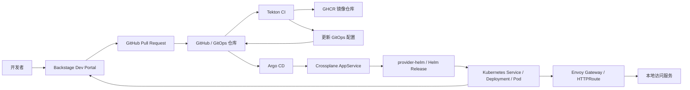
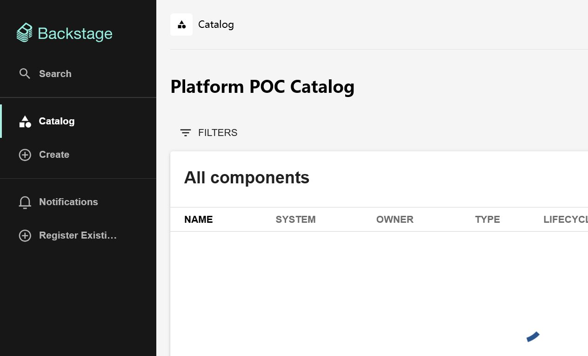
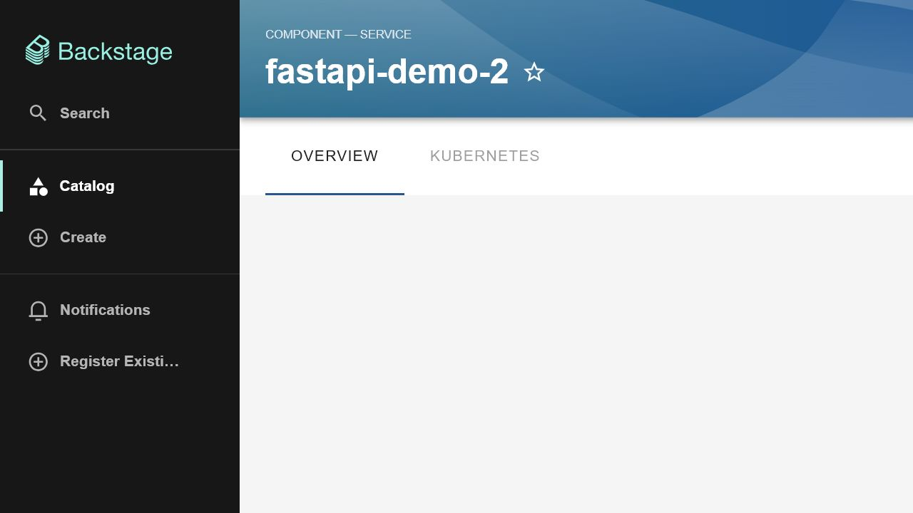
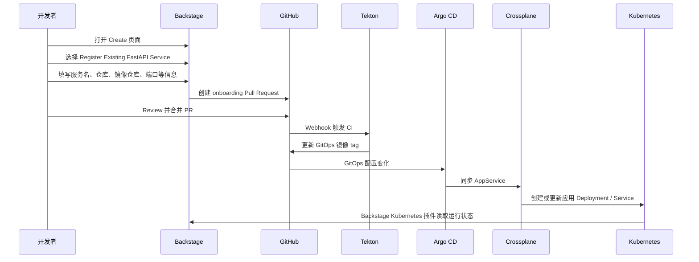

# Crossplane + Backstage + Tekton + Argo CD POC 汇报

更新时间：2026-07-09

## 1. POC 目标

本 POC 基于 `CI CD Pipeline方案.md` 中的方案，验证一套本地云原生应用交付链路。

验证范围包括：

- 使用本地多节点 Kubernetes 集群承载平台组件和业务服务。
- 使用 Crossplane 通过 `AppService` 抽象管理应用交付资源。
- 使用 Tekton 执行 CI 流程。
- 使用 Argo CD 执行 GitOps 持续部署。
- 使用 Backstage 作为开发者门户展示服务目录、创建服务接入流程和服务运行信息。
- 使用 Gateway API 将已部署服务暴露到本地访问入口。

## 2. 总体架构



组件职责：

| 组件 | 当前 POC 中的职责 |
| --- | --- |
| Backstage | 开发者门户、服务目录、服务接入模板、Kubernetes 运行状态展示 |
| Kubernetes kind | 本地多节点运行环境 |
| Crossplane | 提供 `AppService` 应用抽象，通过 Composition 管理底层资源 |
| provider-helm | 由 Crossplane 创建和维护 Helm Release |
| Tekton | 执行源码拉取、测试、镜像构建、镜像推送、GitOps 配置更新 |
| Argo CD | 监听 GitOps 配置并同步到 Kubernetes |
| GHCR | 保存 CI 构建出的容器镜像 |
| Envoy Gateway | 将集群内服务暴露到本地可访问端口 |

## 3. 当前部署环境

本地集群：

| 项目 | 当前状态 |
| --- | --- |
| Kubernetes 集群 | kind 集群 `platform-poc` |
| 节点规模 | 1 个 control-plane 节点，2 个 worker 节点 |
| 本地访问端口 | `30080` 已映射到 kind control-plane 节点 |
| Backstage 访问方式 | `kubectl port-forward` 到 `http://localhost:7007` |
| 服务访问方式 | Envoy Gateway 暴露 `http://localhost:30080/` 和 `http://localhost:30080/health` |

已恢复和运行的平台组件：

| 组件 | 命名空间 | 当前状态 |
| --- | --- | --- |
| Crossplane | `crossplane-system` | Running |
| provider-kubernetes | `crossplane-system` | Installed=True, Healthy=True |
| provider-helm | `crossplane-system` | Installed=True, Healthy=True |
| Argo CD | `argocd` | Running |
| Tekton Pipelines / Triggers | `ci` | Running |
| Backstage | `backstage` | Running |
| Backstage PostgreSQL | `backstage` | Running |
| Envoy Gateway | `envoy-gateway-system` | Running |

## 4. 已完成的 POC 功能

### 4.1 多节点 Kubernetes 集群

已创建本地 kind 多节点集群 `platform-poc`。

集群配置文件：

```text
crossplane-backstage-poc/configs/kind-platform-poc.yaml
```

该配置包含本地端口映射：

```yaml
extraPortMappings:
  - containerPort: 80
    hostPort: 80
  - containerPort: 443
    hostPort: 443
  - containerPort: 30080
    hostPort: 30080
```

### 4.2 Crossplane 应用抽象

已创建 `AppService` 平台抽象。

相关文件：

```text
crossplane-backstage-poc/manifests/platform/appservice-xrd.yaml
crossplane-backstage-poc/manifests/platform/appservice-composition.yaml
```

当前 AppService 状态：

```text
NAMESPACE   NAME             SYNCED   READY   COMPOSITION
default     fastapi-demo     True     True    appservice-helm-release
default     fastapi-demo-2   True     True    appservice-helm-release
default     helloworld       True     True    appservice-helm-release
```

### 4.3 Backstage 开发者门户

Backstage 当前作为开发者门户使用。

当前已接入能力：

- Catalog 服务目录。
- Kubernetes 插件运行状态查看。
- Scaffolder 服务接入模板。
- GitHub Catalog Discovery 自动扫描服务目录文件。
- GitHub PR 创建能力。

Backstage 访问地址：

```text
http://localhost:7007/catalog
```

Catalog 当前展示的服务包括：

- `fastapi-demo`
- `fastapi-demo-2`
- `helloworld`

截图：



### 4.4 服务接入模板

Backstage 中已创建模板：

```text
Register Existing FastAPI Service
```

模板文件：

```text
crossplane-backstage-poc/apps/backstage-custom/templates/register-existing-fastapi/template.yaml
```

模板当前生成以下 GitOps 文件：

```text
crossplane-backstage-poc/gitops/appservices/<service>/Chart.yaml
crossplane-backstage-poc/gitops/appservices/<service>/values.yaml
crossplane-backstage-poc/gitops/appservices/<service>/templates/appservice.yaml
crossplane-backstage-poc/gitops/argocd/<service>-appservice.yaml
crossplane-backstage-poc/gitops/tekton/<service>-ci.yaml
crossplane-backstage-poc/catalog/services/<service>/catalog-info.yaml
```

开发者填写表单后，Backstage 会向 GitHub 创建接入 PR。PR 合并后，Argo CD 和 Backstage Catalog Discovery 从 GitHub 中读取对应配置。

### 4.5 GitHub Webhook 到 Tekton CI

当前 POC 已配置 Tekton EventListener。

当前 EventListener 状态：

```text
eventlistener.triggers.tekton.dev/fastapi-demo-2-ci-listener   READY=True
eventlistener.triggers.tekton.dev/github-listener              READY=True
```

本地 POC 使用 `cloudflared` 将本地 EventListener 暴露给 GitHub Webhook。

链路：

```text
GitHub push
  -> cloudflared quick tunnel
  -> localhost port-forward
  -> Tekton EventListener
  -> Tekton PipelineRun
```

说明：

- `cloudflared` quick tunnel 是临时公网地址。
- PowerShell 窗口关闭或进程停止后，原 tunnel 地址失效。
- 重新测试 Webhook 时，需要重新创建 tunnel 并更新 GitHub Webhook Payload URL。

### 4.6 Tekton CI 流程

当前 FastAPI 服务 CI 流程包括：

```text
拉取源码
  -> 运行测试
  -> 使用 BuildKit 构建镜像
  -> 推送镜像到 GHCR
  -> 更新 GitOps values.yaml 中的镜像 tag
  -> 推送 GitOps 更新到 GitHub
```

当前 Pipeline：

```text
pipeline.tekton.dev/fastapi-demo-2-ci
pipeline.tekton.dev/github-push-smoke
```

### 4.7 Argo CD GitOps 持续部署

Argo CD 当前负责同步平台和应用配置。

当前 Argo CD Application 状态：

```text
NAME                        SYNC STATUS   HEALTH STATUS
fastapi-demo-2-appservice   Synced        Healthy
fastapi-demo-appservice     Synced        Healthy
helloworld-appservice       Synced        Healthy
platform-appservices        Synced        Healthy
platform-ci                 Synced        Healthy
```

GitOps 链路：

```text
GitHub GitOps 配置
  -> Argo CD Application
  -> Crossplane AppService
  -> provider-helm Release
  -> Kubernetes Deployment / Service
```

### 4.8 Gateway 服务访问

已安装 Envoy Gateway，并创建 `fastapi-demo-2` 的 HTTPRoute。

相关文件：

```text
crossplane-backstage-poc/manifests/gateway/fastapi-demo-2-gateway.yaml
```

当前 Gateway 状态：

```text
gateway.gateway.networking.k8s.io/platform-gateway   CLASS=envoy   PROGRAMMED=True
httproute.gateway.networking.k8s.io/fastapi-demo-2
```

本地访问地址：

```text
http://localhost:30080/
```

验证结果：

```http
HTTP/1.1 200 OK
server: uvicorn
content-type: application/json

{"status":"ok"}
```

服务在 Backstage 中的展示：



## 5. 开发者使用流程

当前 POC 中，开发者接入已有 FastAPI 服务的流程如下。



当前使用入口：

| 操作 | 地址或位置 |
| --- | --- |
| Backstage Catalog | `http://localhost:7007/catalog` |
| 创建服务接入 | `http://localhost:7007/create` |
| 已部署服务展示页 | `http://localhost:30080/` |
| 已部署服务健康检查 | `http://localhost:30080/health` |
| `fastapi-demo-2` Catalog 文件 | `crossplane-backstage-poc/catalog/services/fastapi-demo-2/catalog-info.yaml` |

## 6. 当前代码和配置目录

主要目录：

```text
crossplane-backstage-poc/
  apps/
    backstage-custom/              # 自定义 Backstage 应用和模板
    fastapi-demo/                  # FastAPI 示例服务源码
  catalog/services/                # Backstage Catalog 服务实体
  charts/                          # Helm Chart
  configs/                         # kind 集群配置
  gitops/
    appservices/                   # AppService Helm Chart
    argocd/                        # Argo CD Application
    tekton/                        # Tekton CI 配置
  manifests/
    argocd/                        # Argo CD 平台安装和应用配置
    backstage/                     # Backstage Helm values 和 RBAC
    crossplane/                    # Crossplane providers 和 functions
    gateway/                       # Gateway API 资源
    platform/                      # AppService XRD 和 Composition
    tekton/                        # Tekton 基础配置
  scripts/                         # 本地辅助脚本
```

## 7. 当前验证结果

| 验证项 | 结果 |
| --- | --- |
| Crossplane Pod | Running |
| provider-helm | Installed=True, Healthy=True |
| provider-kubernetes | Installed=True, Healthy=True |
| `AppService/fastapi-demo-2` | SYNCED=True, READY=True |
| Argo CD `fastapi-demo-2-appservice` | Synced, Healthy |
| Tekton `fastapi-demo-2-ci-listener` | READY=True |
| Backstage Pod | Running |
| `demo/fastapi-demo-2` Pod | Running |
| Envoy Gateway | PROGRAMMED=True |
| `http://localhost:30080/health` | HTTP 200, `{"status":"ok"}` |

## 8. 当前边界

以下内容在当前 POC 中已经存在，但仍属于本地实验配置：

- `cloudflared` quick tunnel 是临时公网入口，不是固定生产入口。
- Backstage 当前通过本地 `kubectl port-forward` 暴露。
- GitHub、GHCR、Backstage、Argo CD 使用的凭据以 Kubernetes Secret 方式注入。
- Envoy Gateway 目前只为 `fastapi-demo-2` 配置了示例 HTTPRoute。
- `fastapi-demo-2` 的 Gateway 访问已验证 `/health` 接口；根路径展示页需要在服务镜像完成 CI/CD 后作为运行页面展示。

## 9. 展示用访问地址

本地演示时可使用：

```text
Backstage Catalog:
http://localhost:7007/catalog

Backstage Create:
http://localhost:7007/create

fastapi-demo-2 success page:
http://localhost:30080/

fastapi-demo-2 health endpoint:
http://localhost:30080/health
```
